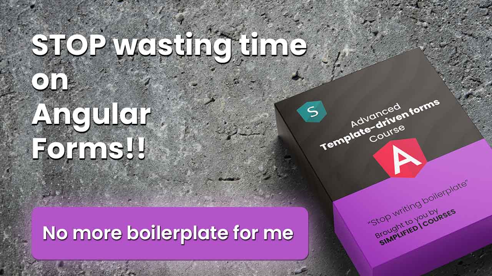

# template-driven-forms

This code is part of the E-course [Advanced Template-Driven Forms](https://www.simplified.courses/complex-angular-template-driven-forms)

I open-sourced this to help developers use Template-driven Forms:
- Without any Boilerplate
- With a focus onReactivity
- With Declarative code
- With Model validations

This project will also be the default project that will be used on the [Template-driven forms playlist](https://www.youtube.com/watch?v=djod9on45wc&list=PLTItqHpooUL4SWBZmVIYXCOTFDaOFdU5N) of Simplified YouTube Channel.

The demo application has the following functionality:
- Show validation errors on blur
- Show validation errors on submit
- When first name is Brecht: Set gender to male
- When first name is Brecht and last name is Billiet: Set age and passwords
- When first name is Luke: Fetch Luke Skywalker from the swapi api
- When age is below 18, make Emergency contact required
- When age is of legal age, disable Emergency contact
- There should be at least one phone number
- Phone numbers should not be empty
- When gender is other, show Specify gender
- When gender is other, make Specify gender required
- Password is required
- Confirm password is only required when password is filled in
- Passwords should match, but only check if both are filled in
- Billing address is required
- Show shipping address only when needed (otherwise remove from DOM)
- If shipping address is different from billing address, make it required
- If shipping address is different from billing address, make sure they are not the same
- When providing shipping address and toggling the checkbox back and forth, make sure the state is kept
- When clicking the Fetch data button, load data, disable the form, and patch and re-enable the form

[Edit in Codeflow ⚡️](https://stackblitz.com/~/github.com/simplifiedcourses/template-driven-forms)